# PokedexPW2
Este proyecto fue realizado por los alumnos Salvatore Pazzaglia, David Ildefonso, Sebastian Anlas y Alejantro Vento para el curso de Programación web 2, utilizando Angular como framework de trabajo.
El proyecto cuenta con las siguientes vistas.
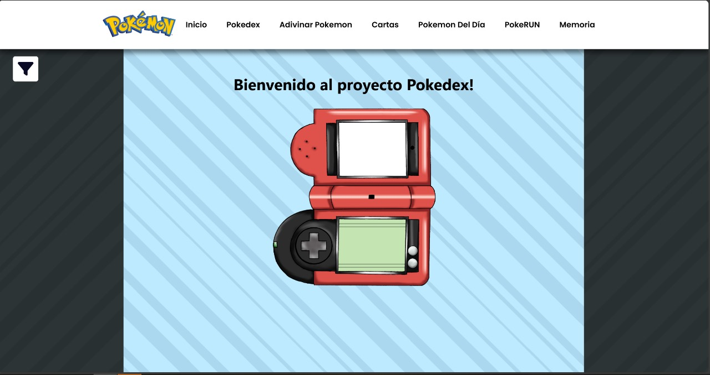
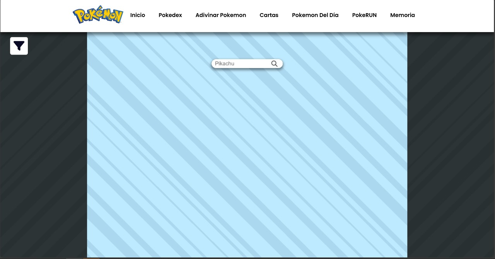
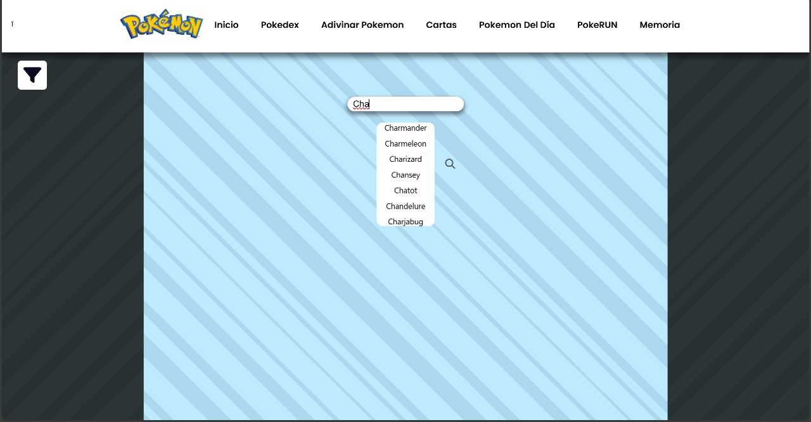
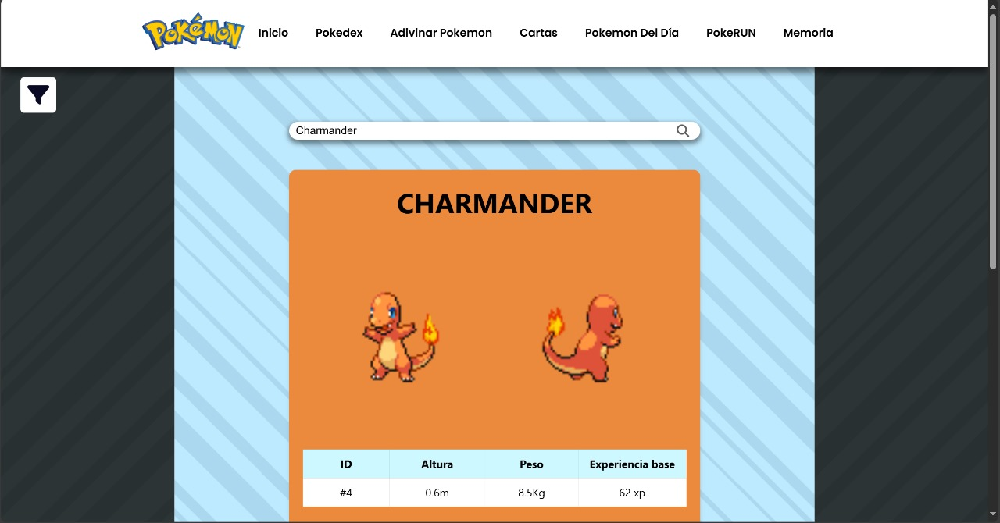
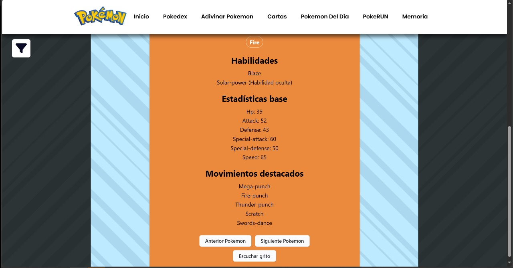
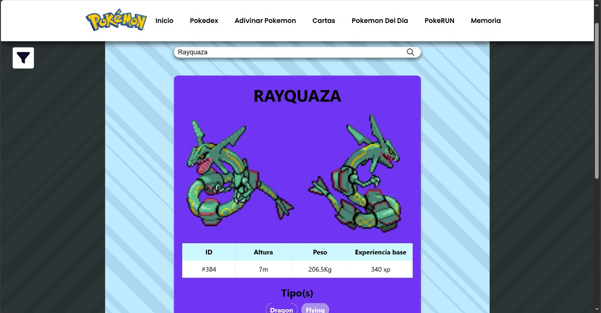
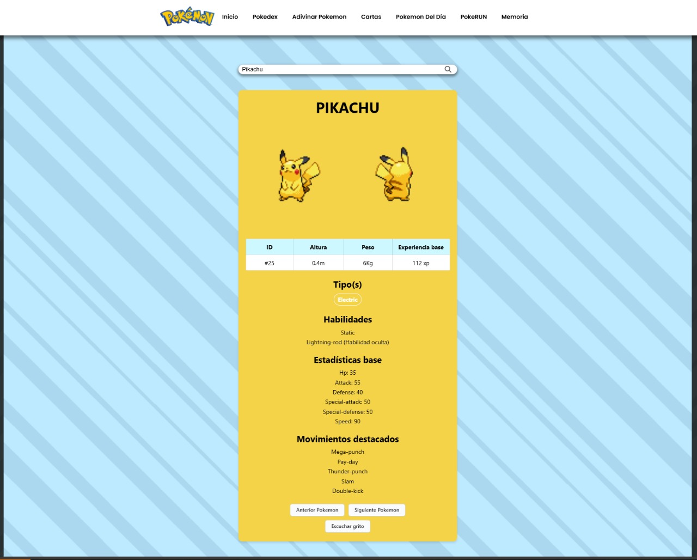
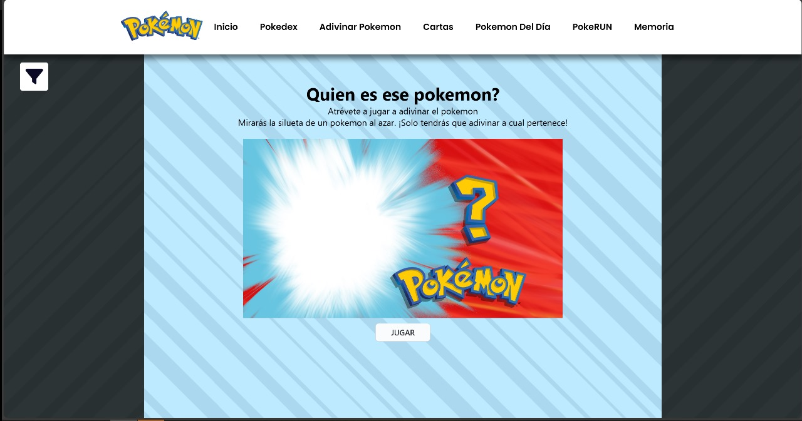
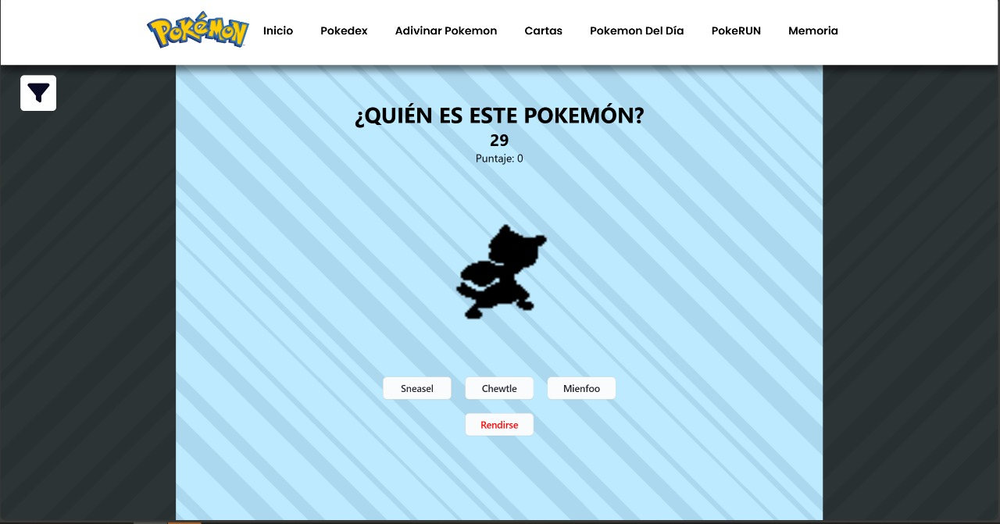
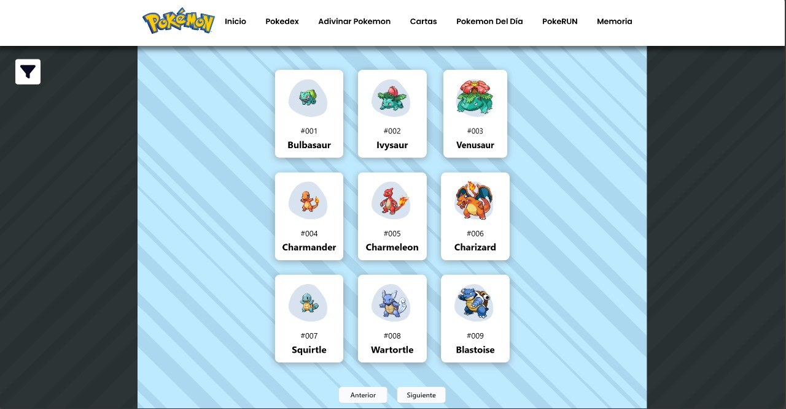
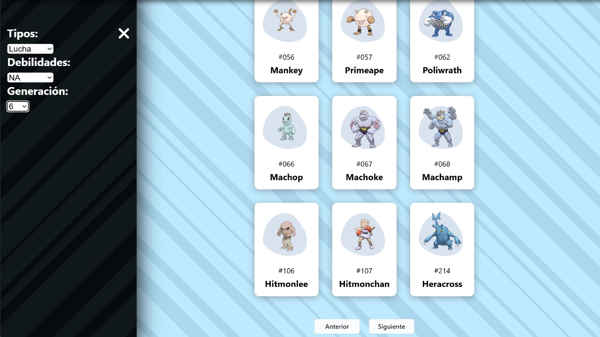
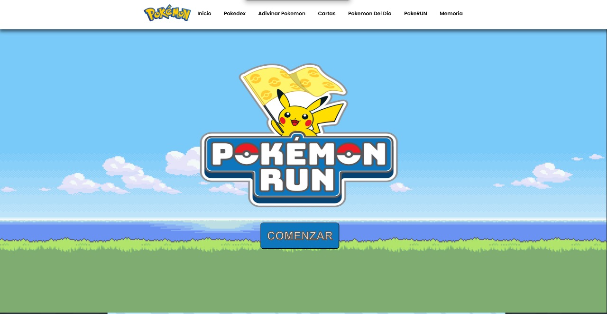
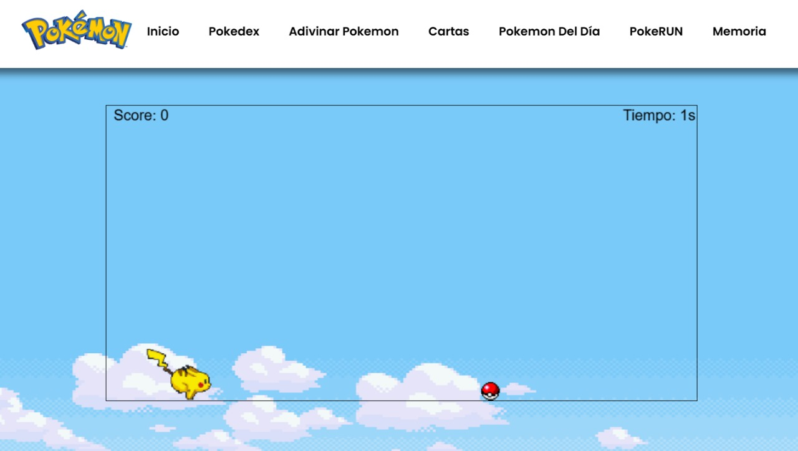

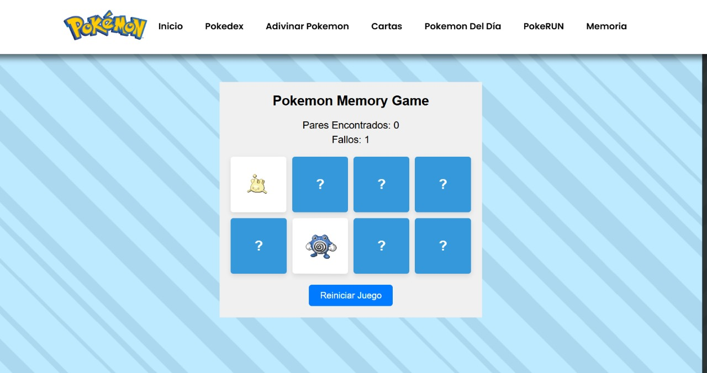

## Developers:

Pasos para ejecutar la app Angular en local usando VS Code.

### Requisitos:
- Instalar Angular y VS Code

### Pasos:

1. Abrir VS Code
2. Presionar `Ctrl + Shift + P` para abrir la paleta de comandos.
3. Escribir `Git: Clone` y hacer clic en la opción que aparece.
4. Ingresar la URL del repositorio `https://github.com/Smogg21/PokedexPW2.git` y hacer clic en `Clone from URL`.
5. Seleccionar la carpeta de destino.
6. Una vez en el proyecto, presionar nuevamente `Ctrl + Shift + P` para abrir la paleta de comandos.
7. Ingresar `Git: Checkout to` y seleccionar la opción `Git: Checkout to`.
8. Seleccionar la rama `origin/angular`.
9. En este punto ya es posible ver el código de la versión Angular en el explorador de VSCode.
10. Abrir la terminal con `Ctrl + ñ` y ejecutar `npm install` para instalar las dependencias.
11. Ejecutar `ng serve` en la terminal para iniciar el proyecto Angular.
12. En el navegador, ir a `http://localhost:4200/` para acceder a la aplicación.
